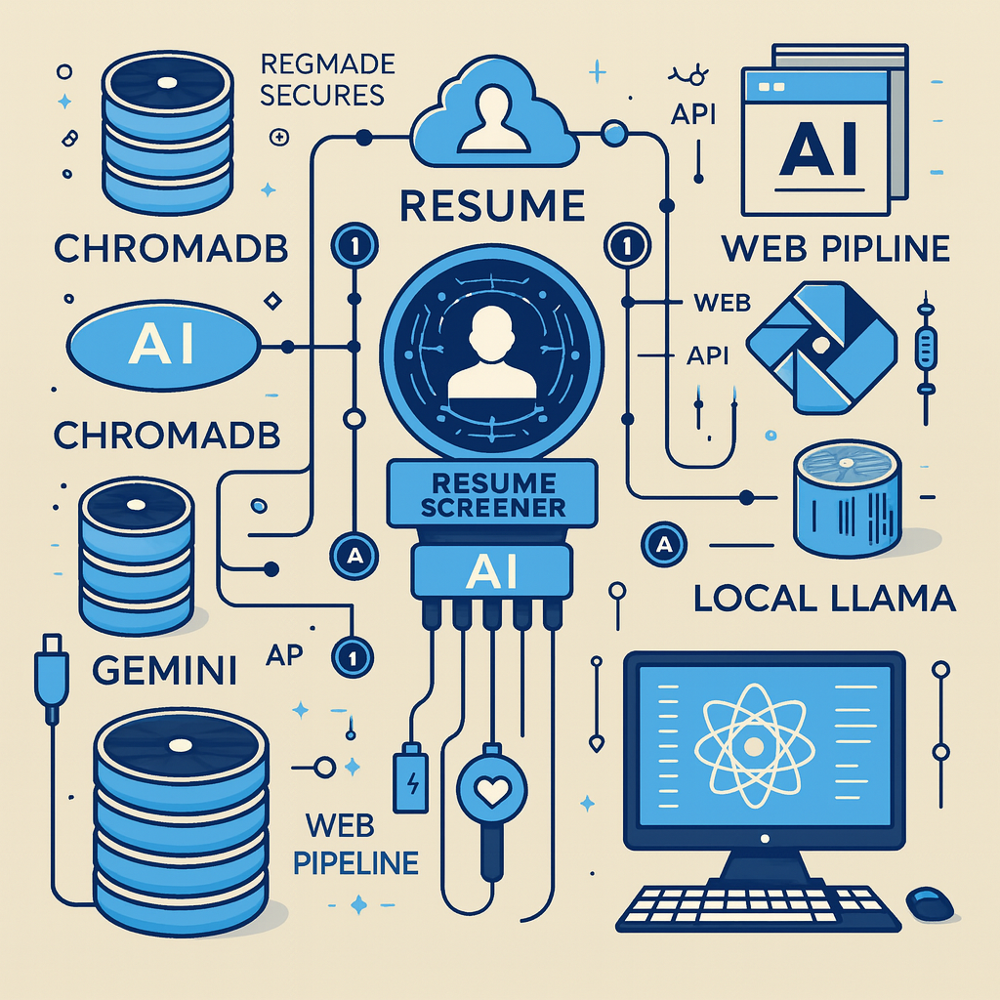

# AI-Based Resume Screener


This repository hosts an AI-based resume screening system designed to scale and handle large volumes of resumes. Built using a Retrieval-Augmented Generation (RAG) pipeline, this system enables efficient resume ingestion and querying, utilizing cutting-edge LLMs and a simple-to-use Flask-based API interface.

## Table of Contents
- [Features](#features)
- [Architecture](#architecture)
- [Setup](#setup)
- [Usage](#usage)
- [File Structure](#file-structure)
- [License](#license)

---

## Features

- **RAG Pipeline**: Retrieval-Augmented Generation (RAG) setup using Langchain and ChromaDB.
- **LLM Integration**: Supports Gemini-1.5-Flash LLM API and an alternative Local Llama 3.2:3b model.
- **Scalability**: Efficiently processes and scales with over 500 resumes.
- **Flask API**: Provides backend APIs to interface the RAG pipeline and LLM with the frontend.

## Architecture

The AI-Based Resume Screener comprises the following main components:

1. **Ingestion and Storage**:
   - Resumes are ingested in a format that allows for easy querying.
   - ChromaDB stores resume embeddings for fast retrieval.

2. **Retrieval-Augmented Generation Pipeline**:
   - Built using Langchain and ChromaDB.
   - Ensures the system finds relevant information in resumes quickly and accurately.

3. **LLM Integration**:
   - Primary: Gemini-1.5-Flash LLM for high-quality language understanding.
   - Alternative: Local Llama 3.2:3b for deployments where Gemini-1.5 access is limited.
  
4. **Backend with Flask**:
   - Flask-based backend APIs allow seamless communication between the frontend and the RAG pipeline.

---

## Setup

To set up this project locally, follow these steps:

### Prerequisites
- **Python 3.8+**
- **Docker (optional for Local Llama)**
- **API keys**:
  - Gemini-1.5-Flash LLM API key (required for LLM integration)
- **Packages**:
  - `pip install -r requirements.txt` (see instructions below)

### Installation

1. **Clone the Repository**:
   ```bash
   git clone https://github.com/yourusername/ai-based-resume-screener.git
   cd ai-based-resume-screener
   ```

2. **Install Required Packages**:
   ```bash
   pip install -r requirements.txt
   ```

3. **Set Up Environment Variables**:
   Create a `.env` file to store your API keys and configuration. Example:
   ```bash
   GEMINI_API_KEY=your_gemini_api_key_here
   ```

4. **Run Local Llama (Alternative LLM)**:
   If you choose to use Local Llama, ensure Docker is installed, and run:
   ```bash
   docker pull local_llama_image
   docker run -d -p 5001:5001 local_llama_image
   ```

5. **Run the Flask App**:
   ```bash
   flask run
   ```

---

## Usage

Once the server is up and running, you can interact with the backend APIs for querying resumes. You can also connect a frontend application to visualize and query the resume data.

### API Endpoints

- **/api/ingest**:
  - **Method**: POST
  - **Description**: Ingests a new resume into the system.

- **/api/query**:
  - **Method**: POST
  - **Description**: Queries the resumes based on the input question using the RAG pipeline.

### Sample Requests

**Ingest Resume**:
```bash
curl -X POST -H "Content-Type: application/json" -d '{"resume_text": "John Doe, experienced data scientist..."}' http://localhost:5000/api/ingest
```

**Query Resume**:
```bash
curl -X POST -H "Content-Type: application/json" -d '{"question": "What is the experience of the candidate in data science?"}' http://localhost:5000/api/query
```

---

## File Structure

- **app/**: Contains the main Flask application code.
- **rag_pipeline/**: Houses the RAG pipeline with Langchain and ChromaDB integration.
- **models/**: Directory for LLM model wrappers (Gemini and Local Llama).
- **data/**: Directory for storing resumes (as needed).
- **requirements.txt**: List of required packages.
- **.env**: Environment file to store API keys and secrets (not included in version control).

---

## License

This project is licensed under the MIT License.
